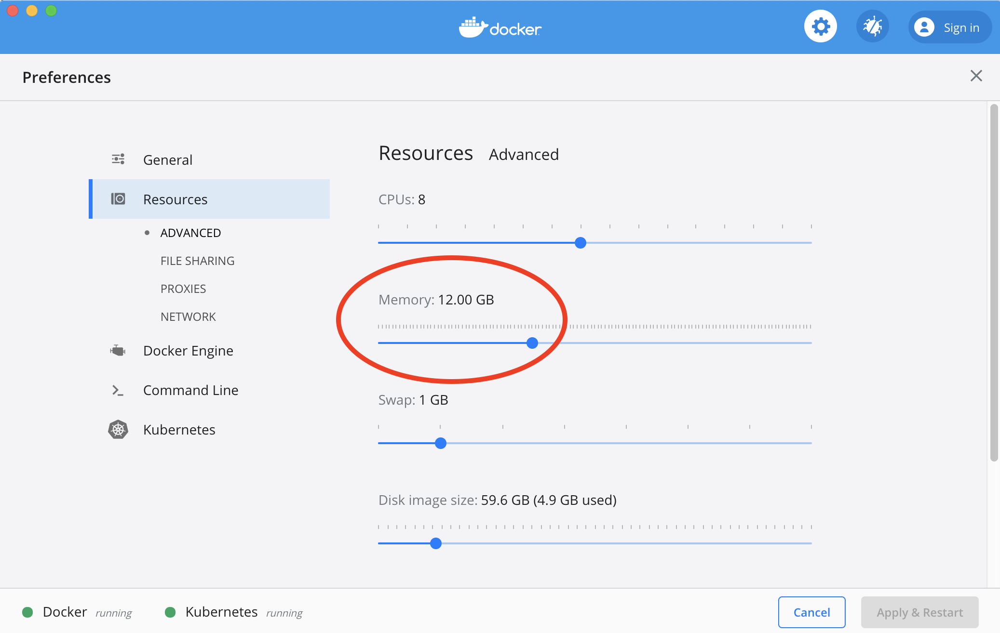
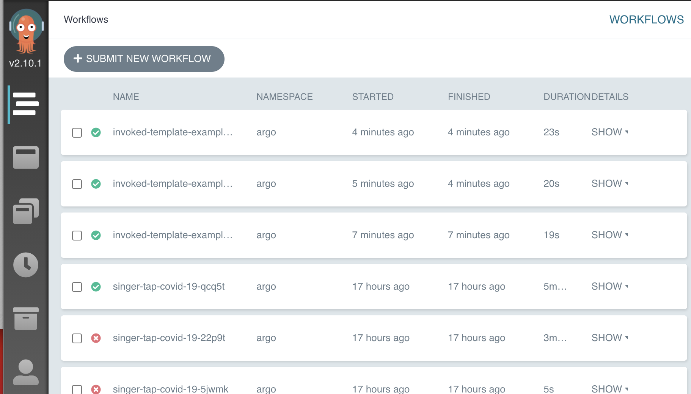

# data-replication-on-kubernetes

ELT is the hot new data pipelining pattern, and thousands of data teams are using some combination of Stitch / FiveTran, dbt and a cloud data warehouse to manage their data warehouse. There are great SaaS offerings for these tools, but a lot of folks like pain or don't have budget. As a small data team at Immuta, we were both.

This article assumes some familiarity with [Docker](https://docker.com), [Kubernetes](https://kubernetes.io/) and the [Singer](https://singer.io) specification. Even if you're new to these technologies, though, I will try to point out helpful resources to get you pointed in the right direction.

First, we will discuss the problem we are trying to solve and why using containers can make a lot of sense. Then, I'll walk you through setting up some workflows at home (as long as your home is Mac OSX Catalina). And finally, we'll talk about considerations you want to make if you'd like to move into production.

## Motivation

Let's start the discussion with two assertions:

1. Data replication is a "solved" problem.
2. Kubernetes is a scalable data (process) management platform.

ETL is not the reason that anyone gets into data science or engineering. There is little creativity, lots of maintenance, and no recognition until something goes wrong. Fortunately, SaaS tools like [Stitch](www.stitchdata.com) and [FiveTran](www.fivetran.com) have pretty much turned data replication into a commodity that small teams can leverage. And where there are no existing supported connectors (for internal applications, say), a data scientist could write their own [Singer](https://singer.io) script and load data themselves.

Keep this last scenario I want to focus on here, because of course a "data pipeline" is hardly _just_ data replication.

The "solved" nature of data replication makes it easier for data scientists to own projects end-to-end, freeing data engineers to think about the "platform" rather than point solutions. ([StitchFix has a terrific post on this.](https://multithreaded.stitchfix.com/blog/2016/03/16/engineers-shouldnt-write-etl/)) In fact, the players in this market recognize that it's really the stuff "around" the integrations that are differentiators: the [Meltano](https://meltano.com) project out of GitLab, for example, found a niche in being [a "runner" for integration processes](https://www.dataengineeringpodcast.com/meltano-data-integration-episode-141/), rather than managing the end-to-end analytics pipeline.

### Singer taps and targets

A quick summary on the Singer spec mentioned above:

- a `tap` connects to service, extracts data, then emits a standardized stream of schemas and records using JSON
- a `target` reads the record stream of a tap and load it into a warehouse

This separation of tap and target decouplesthe "extract" step and the "load" step. So an organization with 10 sources and 1 data warehouse has ten tap-to-target pipelines to manage. If they migrate this database, though, they only need to "swap out" the target; they won't make a single change to any taps.

One pecularity of this isolation is that a best practice for running taps and targets is to isolate them in their own Python virtual environments, since each tap and target may have different dependencies, be built on different Singer versions, etc. And when I first read that, I thought: containers! Yet, there is scarcely a mention of containers in the Singer community, at least as far as I could tell.

### Kubernetes and Argo Workflows

At Immuta, we have a small data team but a world-class engineering organization. As a rule, I like to defer to the engineering team, who have both knowledge and skill, since I, as a data scientist, have neither of these things. 

The rest of our internal infrastructure runs on Kubernetes; as the lone data scientist, I felt the peer pressure of learning k9s and managing kubeconfigs. And I’m here to say -- this is a great approach, if you’re willing to do some dirty work.

[Argo](https://argoproj.github.io/) is the "Kubernetes-Native Workflow Engine"

Argo Workflows is an open source container-native workflow engine for orchestrating parallel jobs on Kubernetes. It is an alternative to other orchestration tools, such as Airflow or Prefect, and the key differentiator is that it is container-based. This Data Council talk provides a nice comparison with Airflow specifically:  [Kubernetes-Native Workflow Orchestration with Argo](https://www.datacouncil.ai/talks/kubernetes-native-workflow-orchestration-with-argo)

Now that we have a motivation for using Singer and Argo together, let's get to work!

## Tutorial

In this tutorial, we are going to first set up a local Kubernetes cluster with Argo and Minio storage for artifacts and config files,
then we will deploy a Singer tap-to-target workflow, and then we'll discuss enhancements and extensions.

We could go deep on any one of these areas, but I'll try to keep it shallow and manageable for the tutorial, leaving further discussion for "production" considerations to the end. The tutorial has the following pre-requisites:

1. Docker Desktop. Installed locally, with your Kubernetes for Docker (Minikube / another cluster is fine as well)
2. Helm. We will install both Argo and Minio for running this tutorial.

To start, we are going to be using two of the simplest singer.io packages -- `tap-exchangeratesapi` and `target-csv` -- for demonstrating how this works.

### 1. Setting up Argo

In this first section, we need to set up a Kubernetes cluster, Argo Workflows, an artifact repository, and a couple of storage buckets. The simplest approach is to use Docker for Desktop, which is multi-platform and can deploy a Kubernetes cluster in it. This also makes local development a bit easier, since you can build containers and deploy to a local cluster without pushing to external container repositories.

#### Install Docker Desktop and enable Kubernetes

Youu will need to have a Kubernetes cluster which you have admin access to and can deploy resources to using `kubectl`. If you already have that, then you can skip this section. If you don't, the easiest way to do it is using Docker for Desktop. You'll want to follow the documentation on Docker's website.

1. Install Docker for Desktop. [Mac](https://docs.docker.com/docker-for-mac/install/).
2. Enable Kubernetes. [Mac](https://docs.docker.com/docker-for-mac/kubernetes/)
3. Bump up Docker's resource allocation to at least 12 GB to ensure enough room for Minio storage
   - 
4. Test out the `kubectl` command. [Mac](https://docs.docker.com/docker-for-mac/kubernetes/#use-the-kubectl-command)
5. Install the latest Argo CLI. [Mac](https://github.com/argoproj/argo/releases)

Once you have that working, feel free to play around with your Kubernetes cluster.

#### Install Argo Workflows

Next, we need to install Argo. You can follow the [Quick Start Guide](https://argoproj.github.io/argo-workflows/quick-start/) to get some context, or simply use the commands below to create an `argo` namespace in your cluster and deploy the resources.

```{zsh}
# Create the argo namespace then deploy the "quick start" resources
kubectl create ns argo
kubectl apply -n argo -f https://raw.githubusercontent.com/argoproj/argo/stable/manifests/quick-start-postgres.yaml
```

You should now have an Argo server and a few new Kubernetes resource types used by Argo, including `Workflow` and `CronWorkflow`. To get a glimpse of the Argo Workflows UI, you can forward the Kubernetes port to your localhost.

```{zsh}
kubectl -n argo port-forward deployment/argo-server 2746:2746
```



#### Set up Minio Storage

Argo Workflows can pass files into or out of a container through the use of "artifacts". For local deployments, an easy way to configure artifact passing is through a Kubernetes deployment of [MinIO](https://min.io/). Argo has [plenty of guidance](https://argoproj.github.io/argo/configure-artifact-repository/) on setting this up with other services, but you can follow along below for a quick MinIO deployment.

Note that you'll need to have `helm` installed (essentially, a Kubernetes package manager). On Mac, you can use Homebrew: `brew install helm`. Then, run the following:

```{zsh}
# Add the MinIO helm chart
helm repo add minio https://helm.min.io/
helm repo update

# Deploy MinIO in the "argo" namespace (this may take a minute)
helm install argo-artifacts minio/minio     \
  -n argo                                   \
  --set service.type=LoadBalancer           \
  --set defaultBucket.enabled=true          \
  --set defaultBucket.name=artifacts        \
  --set persistence.enabled=false           \
  --set fullnameOverride=argo-artifacts
```

You now have an artifacts server running, but it's empty! Let's create an artifacts bucket, along with a bucket for singer configuration and outputs. To use the commands below, you'll need the MinIO CLI tool: `brew install minio/stable/mc`.

```{zsh}
# Add config host
mc config host add argo-artifacts-local http://localhost:9000 YOURACCESSKEY YOURSECRETKEY

# Create buckets in min.io
mc mb argo-artifacts-local/artifacts
mc mb argo-artifacts-local/singer
```

You can go and check these in your browser using `kubectl -n argo port-forward service/argo-artifacts 9000:9000`.

```
mc ls argo-artifacts-local
```

#### Map Argo and MinIO together

 on setting up your artifact repository. But let's just start with the below for now:

Finally, we need to tell Argo where the default artifact repository is, so that it knows which bucket to map artifacts to and has the appropriate secrets for authentication. You could follow the instructions [elsewhere](https://sourcegraph.com/github.com/argoproj/argo@095d67f8d0f1d309529c8a400cb16d0a0e2765b9/-/blob/demo.md#5-install-an-artifact-repository), but for simplicity's sake, I suggest
applying this "patch" to your resource.

```{zsh}
wget -o patch.yml https://raw.githubusercontent.com/stkbailey/data-replication-on-kubernetes/master/argo/argo-artifact-patch.yml
kubectl patch configmap workflow-controller-configmap -n argo --patch "$(cat argo-artifact-patch.yml)"
```

To make sure you've got everything working in this first section, try running the "artifact-passing" example from the Argo examples repository.

```{zsh}
argo submit -n argo https://raw.githubusercontent.com/argoproj/argo/master/examples/artifact-passing.yaml --watch
```


### The Argo workflow

You've got Kubernetes, you've got Argo: let's not wait around! Run the following command:

```
argo submit -n argo --watch https://raw.githubusercontent.com/stkbailey/data-replication-on-kubernetes/master/argo/tap-exchange-rate-workflow.yml
```

You should see a workflow kick off in your terminal. (Alternatively, you could go to that link, copy the text and paste it into the Argo Workflows "new workflow" UI.) If you receive an error message that says something along the lines of `failed to save outputs: timed out waiting for the condition`, simply try running the workflow again.

You should see a two-step Workflow create and finish. Let's check the "outputs" storage bucket and see what's available.

```
mc ls argo-artifacts-local/singer/outputs/tap-exchange-rates/
```

#### Dissecting the workflow

Let's walk through what this tap does:

1. It starts a `tap-to-target` multi-step workflow, consisting of two child steps: the `tap` and the `target` step.
2. It kicks off the `tap` child step and passes in some configuration files, which get mapped to `/tmp/config.json`. When the tap step completes, the output file at `/tmp/tap_output.txt` is stored in the default MinIO artifact repository.
3. It then kicks off the `target` child step and maps both configuration and tap output into the containers file system. When the target runs, the output (from the CSV target) is mapped to the `outputs` MinIO bucket.

Argo makes all of this extremely "template-able", as we'll see in a few moments. But it is all dependent on the containers knowing where to expect certain files, etc. Which leads us to ask: What's going on in the containers?

#### The Preamble

We begin the Workflow by adding some metadata andd specifying that we want to create a "Workflow" resource. This is a single run of the workflow.

```
apiVersion: argoproj.io/v1alpha1
kind: Workflow
metadata:
  name: singer-workflow
  namespace: argo
spec:
  entrypoint: <<template-name>>
  templates: [ ... ]
```

Next, we specify our DAG templates. We will be building three of these: a `tap-to-target` DAG, a `tap`, and a `target`. We _could_ do this all in a single step, but we'll talk about reusability in a moment.

Let's begin with the DAG template, which takes a couple input parameters -- names, images and the artifact bucket

- name:
- input parameters
- steps:

The DAG Workflow references a couple other "templates" that also need to be defined. 

- name:
- container
- input parameters:
- input artifacts:
- output artifacts:

You can re-run the workflow, changing the configuration as desired. And that's the beauty of this workflow: once set up, it's simply a matter of changing some container locations and config files to add a new tap. 

#### Dockerizing Singer

Let's put Kubernetes to the side for a moment and focus on a typical Singer pipeline. It's a linear process:

1. Tap inputs: configuration file, catalog file, state file.
2. Tap outputs: a stream of log data in Singer format.
3. Target inputs: configuration file, tap output stream.
4. Target outputs: loaded/exported data (e.g. to a database or CSV file), state file

We can treat the containers themselves as black boxes, so long as we know how to feed in the appropriate inputs and outputs. To keep things simple in this tutorial, I have pre-created `tap` and `target` containers for our use. To test it out, run this command:

```{zsh}
docker run -e START_DATE=2020-08-01 stkbailey/tap-exchange-rates
```
This should kick off the `tap-exchangeratesapi`, which doesn't require any special configuration to run.

Without going into too much detail, we are wrapping the singer "tap / target" commands in a Runner object that defines where to look for the necessary files. (It's available at [singer-container-utils](https://github.com/immuta/singer-container-utils).) THere are many ways to skin that cat at this point, but the important thing is to make it easy to reproduce across multiple taps.

We won't dig into the details, but each of these Docker containers is running a Python `entrypoint.py` script when they are initialized. The gist of the entrypoint script is:

1. Identify the paths where `config`, `catalog`, `state` and `input` files exist.
2. Build the appropriate tap/target executable command, based on file availability.
3. Run the command and write output to a file.

It's a lot of overhead for a single command, but when you have multiple containers to run, the abstractions make life easier.


## Discussion

It is hopefully not hard to see how, with a few additional tweaks and some well-protected S3 buckets, this couldl be turned into a fairly robust architecture. We can easily turn the workflow specified above into an Argo `TemplateWorkflows` and reference it in a `CronWorkflow` to have it run on an hourly or daily basis.

But, exciting as all this is, it has to be noted that this is not for the faint of heart. As a data scientist, there are a lot of considerations.

- How are you building and updating the containers? Does your cluster have access to that container repository?
- How are you triggering new workflows?
- Networking can be a pain.

You may find that `pipelinewise` or `meltano` can do the same work for you, with less overhead. Alternatively, you may find that running them on Argo gives you a nice method for doing custom replications.

### Logging and observability are _different_ in containers

We use a Slack exit-handler to notify our team of successes and failures. 

### Schedules and templates

The "promised land" of Argo, though, is that once it is set up, you simply have to change the image location to add a new tap -- and this is true! The only thing that should change between runs is the container that's invoked and the configuration files passed in.

The questions you need to ask are:

- Do I have the budget to just pay for this (Stitch / Fivetran)?
- Does a simpler (single-node) architecture work, such as Meltano?
- Does a Kubernetes architecture fit with the rest of the company's infrastructure?
- Can I reuse the Argo architecture for other processes, such as transformation pipelines, data quality testing, etc?

At Immuta, we went with this architecture becuase:

1. We didn't have budget (yet) for an enterprise service but found ourselves needing to run custom taps.
2. We were already comfortable with containerized applications.
3. The rest of our company's infrastructure was run on Kubernetes and leveraged other Argo products.
4. We had other projects, such as data quality jobs, that we need a platform to run on, and we did not have previous expertise with Airflow or Prefect.

Thanks for reading!

## References

- Getting Started with Singer [Blog](https://github.com/singer-io/getting-started)
- Building a Singer Tap - Infographic [Blog](https://www.stitchdata.com/blog/how-to-build-a-singer-tap-infographic/)
- Singer Container Utils [GitHub](https://github.com/immuta/singer-container-utils)

## Draft

#### Doing this at home

1. Create an Argo Workflow template that uses variables to select the tap and target container. This serves as the backbone of your process; everything else is parameterized.
2. Create a `target` container for your data warehouse. 
3. Save the `config.json` for your target to a secure location.

Once that's set up, for each new tap, you:

1. Create a new `tap` container. The tap runs a Python script on start that checks a few default locations for configs, catalogs, etc. Deploy the new container to ECR so that it is accessible by the Argo service user.
2. Save the `config.json`, `catalog.json`, and an initial `state.json` to a config folder on S3.
3. Create a new CronWorkflow (or Workflow Template) for your job, that references your

You should see that the container emits a logging stream of updates -- but it does not emit the actual data itself. This is slightly different from how the tap would work if you were to run it locally. What we have done instead is written the tap output to a file inside the container.

This decision makes it less straightforward to simply "pipe" the output of one container to another, but it gives us greater control over where the logs (which are the data) are ultimately stored.

Now, let's try mapping a configuration file into the container, rather than providing a `START_DATE` configuration directly.

```
docker run    \
    --mount type=bind,source="$(pwd)"/singer-configs/tap-exchange-rates/config.json,target=/opt/code/config.json \
    stkbailey/tap-exchange-rates:latest
```

You should see a similar results to the first run.

Next, let's take a quick look at how the target works by running

```{zsh}
docker run                          \
    --env DESTINATION_PATH=/tmp     \
    stkbailey/target-csv:latest
```

Once again, we could map some additional files into the container -- and will need to do so to pass the tap output along.
